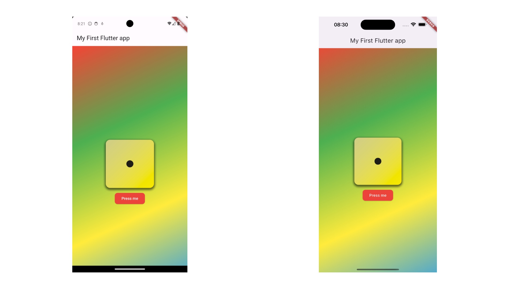

###
- Android_Pixel_6_API34
- iPhone_15_Pro_Max_iOS17.0

# ROLL DICE APP
* Plaform: iOS / Android
* Language: Dart SDK version 3.2.3 (stable)
* Framework: Flutter 3.16.3 (stable)

## Acknowledgement
ROLL DICE APP is a code-along project under the tutorial by Maximilian Schwarzmuller from Academind.
[Academind](https://academind.com/)

## Introduction
It rolls a dice for you !
Press the button and test your guess !

## Overview
- Written in Dart 
- Uses Flutter Framework
- No External Dependencies
- Built in VSCode 1.83.1 (Universal)

## Testing & Notes
➕ Even though this is a tutorial app, I added some changes and tried differently than Maximilian's version.
It was a good experience with Flutter over all.

